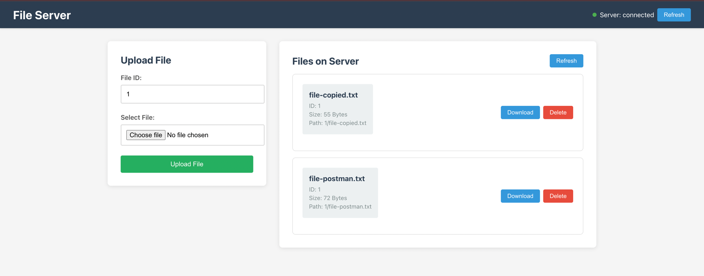

# File Server Frontend

A simple React frontend for the file server backend.

## Features

- Upload files to the server
- Download files from the server
- Server health status indicator
- Clean, responsive interface

## Setup

1. Install dependencies:
```bash
npm install
```

2. Start the development server:
```bash
npm start
```

3. Open [http://localhost:3000](http://localhost:3000) in your browser

## Backend Setup

Make sure the file server backend is running on `http://localhost:9095` before using the frontend.

## Usage

1. **Upload**: Select a file, enter an ID, and click "Upload File"
2. **Download**: Click the "Download" button next to any uploaded file
3. **Server Status**: Check the indicator in the header to see if the backend is running

## File Structure

```
src/
├── components/
│   ├── FileUpload.js      # File upload component
│   ├── FileList.js        # File list component
│   ├── FileManager.js     # Container for file operations
│   └── ServerStatus.js    # Server health indicator
├── services/
│   └── fileService.js     # API service
├── App.js                 # Clean main app container
└── App.css                # Styles
```

## Architecture

- **App.js**: Clean container that renders main components
- **FileManager.js**: Handles all file-related state and logic
- **ServerStatus.js**: Manages server health checking
- **Service layer**: Clean API calls separated from components



Simple and clean React architecture following best practices!
